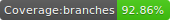
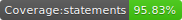

# Vue Unleash

[](https://app.codeship.com/projects/378002)





A Vue plugin for [Unleash](https://unleash.github.io/).

Vue Unleash provides an integration for Vue and the Unleash open-source feature flag platform.

_This plugin requires that your project use Vuex_

## Install

```bash
yarn add -D vue-unleash
# or
npm i -D vue-unleash
```

```javascript
import Vue from 'vue';
import VueUnleash from 'vue-unleash';
import Vuex from 'vuex';

Vue.use(Vuex);

const store = new Vuex.Store({});

/**
 * The <unleash-feature /> component is registered
 * globally during installation.
 */
Vue.use(VueUnleash, {
  // Optional, name of app
  appName: 'MyAppName',

  // Required, Unleash instance host
  host: 'https://my-hosted-unleash.io',

  // Required
  store,

  // Optional, providers to handle strategy logic
  strategyProviders: {
    /**
     * Example strategy provider
     *
     * @param {object} strategy Strategy object from Unleash API
     * @param {object} unleashState Full state from unleash Vuex module
     * @return {boolean} If enabled or not
     */
    applicationHostname({ parameters: { hostNames } }, unleashState) {
      return hostNames.split(',').includes('www.vue-unleash.io');
    }
  }
});
```

## Component Usage

```javascript
<template>
  <unleash-feature name="AddUser">
    <add-user-form />
  </unleash-feature>
</template>
```

## Store Usage

```javascript
export default {
  mounted() {
    // Get all features
    console.log(this.$store.state.unleash.features);

    // Get weather initial loading is occurring
    console.log(this.$store.state.unleash.loading);

    // Re-fetch data
    this.$store.dispatch('unleash/fetch');
  }
};
```

## Scripts

```bash
yarn lint
```

```bash
yarn test
```

```bash
yarn build
```

## How to Contribute

### Pull Requests

1. Fork the repository
2. Create a new branch for each feature or improvement
3. Send a pull request from each feature branch to the **develop** branch

## License

[MIT](http://opensource.org/licenses/MIT)
